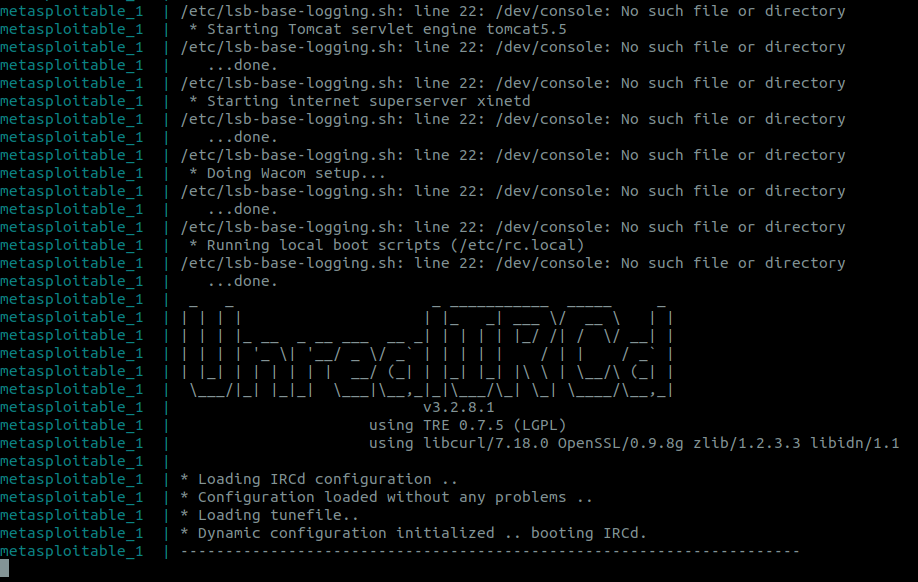

# Labs 

This is the repository for the Metasploit lab. Here we have a basic dockerfile network that connects a Kali OS to a Metasploitable2 OS. 
   
Metasploitable is a highly vulnerable OS made specifically to practice pentesting on!

# Download the docker-compose file
To help with organizing and deploying this lab, we are using docker-compose to build, network, and run the docker containers.

## Install:
```bash
sudo apt install -y docker-compose
```
## Download docker-compose file
Either download or copy/paste the file `docker-compose.yml` into a suitable folder.
Using cUrl or wget is also a short command:
```bash
wget https://raw.githubusercontent.com/CSC-IU/Metasploit-Lab/master/docker-compose.yml
```

# Run docker-compose
In the same directory as the `docker-compose.yml` file:
```bash
docker-compose up
```
Be sure to leave this terminal window up! 

It may take some time to finish, this is what it will stay at once finished running:



# Test
After opening a new terminal session, run the following command to enter the Metasploit container:
```bash
docker exec -it metasploit /bin/sh
```

In the current directory (`/usr/src/metasploit-framework`), run the following command to enter metasploit:
```bash
./msfconsole
```

Now test your connection and do a light check of what services are running on Metasploitable2!
```bash
msf6 > nmap metasploitable
```
(Note: you just type `nmap metasploit`, not the `msf6 >` part)

# Exit

To exit Metasploit simply type `exit` and press enter.

To stop the container, close the terminal with `CTRL + D`, or type `exit` and press enter.

To close the containers and network, run this command in the same directory you kept `docker-compose.yml`:
```bash
docker-compose down
```

If you want to completely remove the images (be aware this means you would have to redownload them if you wanted to test it again), type:
```bash
docker rm -f metasploit metasploitable
docker system prune -a
```
